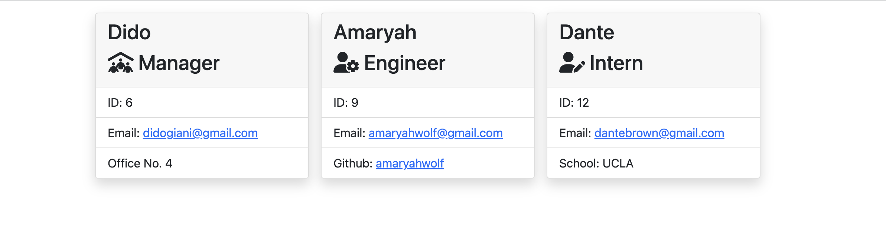

# Team Profile Generator
 

## Description
This application is designed to create team profile cards for all members of your team. It includes one manager card, and unlimited engineer and intern cards. It displays the employee's name, role, ID #, email, office number for the manager, github profile for the engineer and school for the intern. It easily helps organize your team member's information and provides a simple links to access their emails and github profiles.

## Table of Contents
- [Installation](#installation)
- [Usage](#usage)
- [Credits](#credits)
- [License](#license)
- [Contributing](#contributing)
- [Tests](#tests)
- [Questions](#questions)

## Installation
To install the necessary packages to run this program, run npm i in the terminal. To start entering data on your team members, run npm start in the terminal.

## Usage
To use the application, install the necessary packages and begin responding to the prompts. After you have filled out information for each team member, an HTML file will be generated where you can easily view your team members' information as seen below. Check out this [video](https://drive.google.com/file/d/1fC8SMu0DH3C-wPzHoGw3XDbP27LjDSzk/view) for a walkthrough of how to use the application!

## Credits
Collaborators: Amaryah Wolf

## License
This application is covered under the MIT license.

## Contributing
N/A

## Tests
To run the tests, run npm test in the terminal.

## Questions
For additional questions, find me on [github](https://github.com/amaryahwolf) or email me at amaryahwolf@gmail.com.
